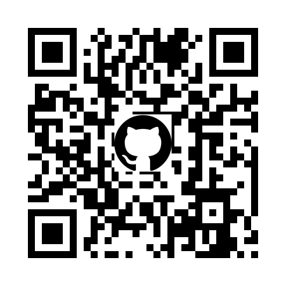

# qr_with_logo

Python code to generate QR code with logo inside.



## Install

Please install this with `pip` command.

```
pip install git+https://github.com/aikige/qr_with_logo.git
```

## Synopsis

> **qr_with_logo** \[**-h**\] \[**-o** *OUTPUT_FILENNAME*\] \[**-l** *LOGO_FILENAME*\] \[**-i** *INPUT_FILENAME*\] \[**-t**\] \[**-s** *SIZE*\] \[**-v** *VERSION*\] \[**-b** *BG_COLOR*\] \[*BODY*\]

## Description

This is script which can be used to generate QR code with logo image at center of it.

For those who is simply want to generate QR code, please use `qr` command distributed with [qrcode](https://github.com/lincolnloop/python-qrcode) package of Python.

### Options

- *BODY* &mdash; this is string which is converted to the QR code.
- **-h** &mdash; show help message.
- **-o** *OUTPUT_FILENNAME* &mdash; this is option to specify output filename. `output.png` will be used when nothing specified.
- **-l** *LOGO_FILENAME* &mdash; this is used to specify file which contains logo data.
- **-i** *INPUT_FILENAME* &mdash; if `-i` option is set, script reads text from the file and use as contents of QR code.
- **-t** &mdash; when this option is set, transparent part in logo are kept transparent, otherwise black background is used for logo area.
- **-s** *SIZE* &mdash; this option is used to change size of logo (in pixel), by default 25% of QR Code size is used as size of logo.
- **-v** *VERSION* &mdash; "version" means size of QR code ([reference](https://www.keyence.com/ss/products/auto_id/codereader/basic_2d/qr.jsp)), this option can be used to change size of QR code. By default, version is determined based on input data.
- **-b** *BG_COLOR* &mdash; this option specifies background color used for QR code.

Either of *BODY* or **-i** option shall be set to run this script.

## Note

This module sets QR Code error correction level to Q, in this case error correction capability is approximately 25%.

By default, this script draws logo using 25% of QR code width, this means 6.25% of QR code modules are hidden by the logo and this is within the ratio can be corrected by error correction.

## Reference

- QRCode.com > [Error Correction Feature](https://www.qrcode.com/en/about/error_correction.html)
